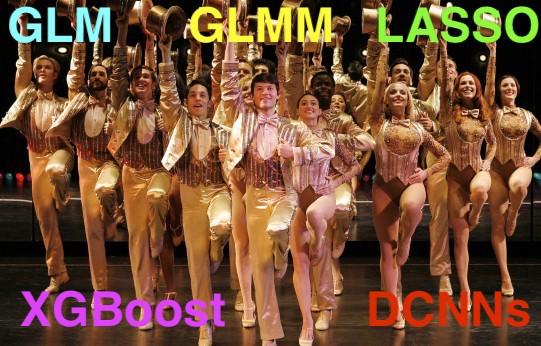

# A "Revue" of Models for Statistical Inference and Machine Learning

A high-level overview of common models used for inference (linear, generalized linear, generalized linear mixed, LASSO, ElasticNet) and prediction (random forests, gradient boosted trees, neural networks). Intended use case, deployment strategies, advantages and common pitfalls for each will be discussed. Example code for all models provided in both R and Python for quick adaptation to your project. From known parameters, we will create synthetic data with ever-more exotic variance structures (non Gaussian-distributed, non i.i.d., heteroscedastic data), visualize the data, and use appropriate models to back out the parameters we used to make the data. Considerations including preprocessing, interpretation, diagnostics, model selection, outliers, overdispersion, and corrections for multiple comparisons will be discussed.

## Prerequisites:

* Must have taken an Intro to Stats course at some time in your life.
* Must have run some R or Python code of your own accord at some time in your life.
* Must know what a data frame is and what it's used for.
